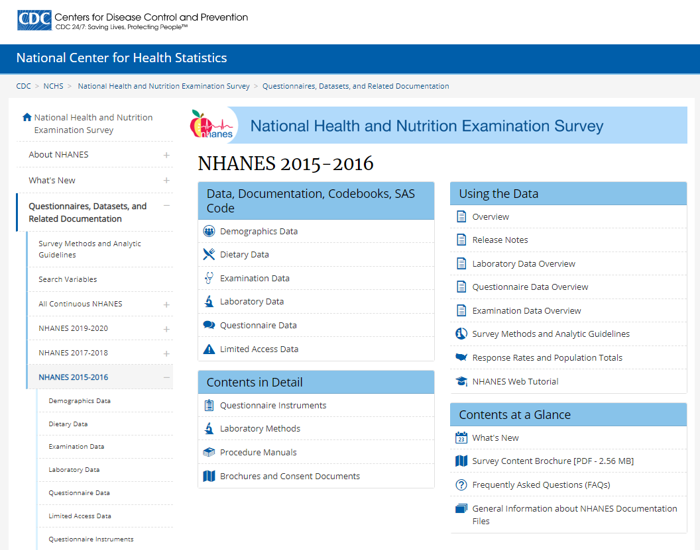
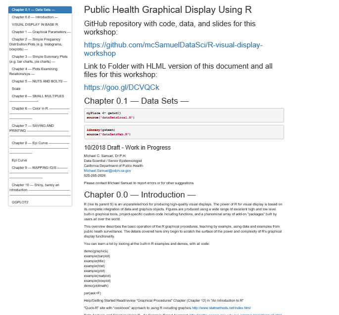
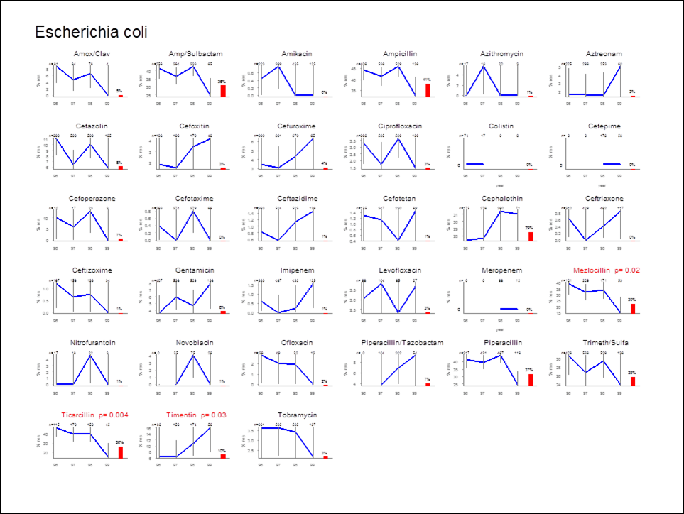
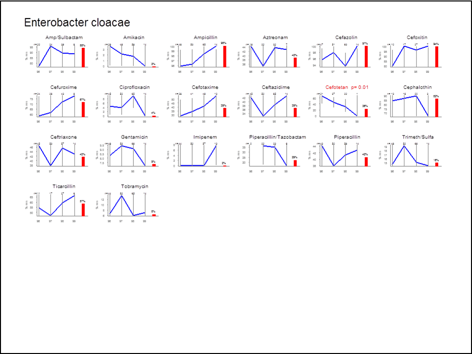
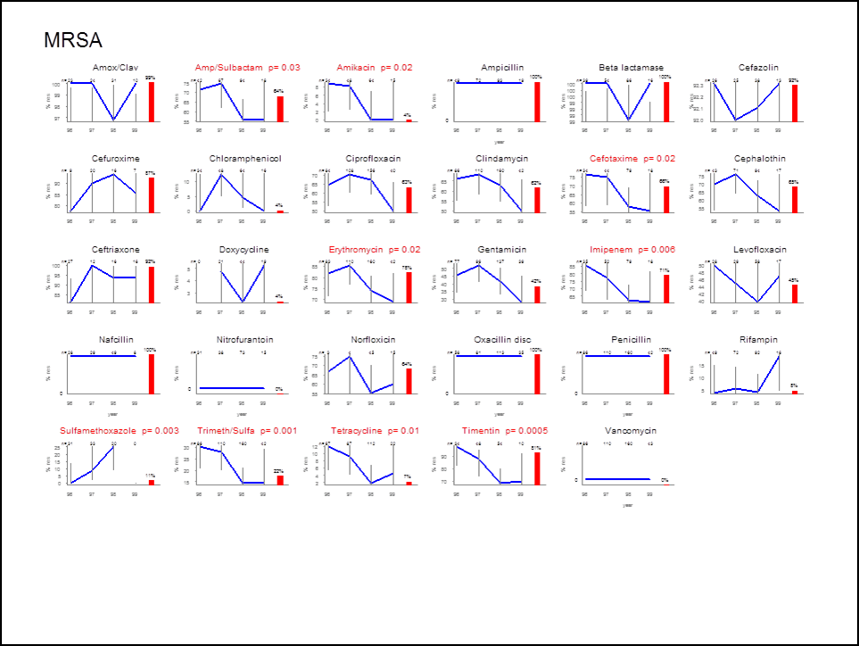
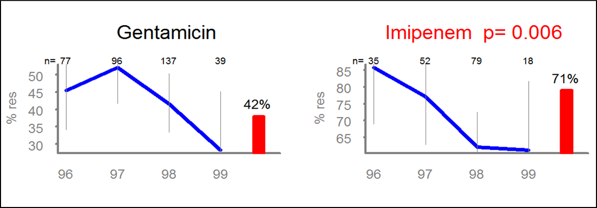

##

- Michael C. Samuel, DrPH
- Senior Epidemiologist / Data Scientist

<br> 

- https://github.com/mcSamuelDataSci/R-visual-display-workshop
- https://tinyurl.com/SamuelVizR
- https://tinyurl.com/SamuelVizR-2-0

<br>

- Michael.Samuel@cdph.ca.gov
- samfam921@gmail.com

<br>

- 925.285.2926


```{r setup, include=FALSE}
knitr::opts_chunk$set(echo = TRUE, warnings = FALSE, message = FALSE)  
options(warn = -1)  # https://github.com/rstudio/blogdown/issues/90
```

## Visual Display Packages and Tools in R
- base R graphics
- ggplot2 (and tidyverse)
- Shiny interactive "system"
- "Computational doucments" (R markdown)
- plotly interactive "hover and clicking"
- other packages
  - special features to enhance figures
  - stand alone specialized figures
  
## Graphics for what?
- Exploring data
- Polished figure(s), e.g. for manuscript
- Slides for colleagues
- Interactivce website
- (One time versus ongoing)


# LET'S DO IT!

## loading libraries, setting values, and making constants

```{r}
library(dplyr)         # data wrangling powerhouse
library(summarytools)  # quick/great summaries of data
library(readr)         # read .csv and other files
library(readxl)        # read excel files
library(Hmisc)         # has function to read SAS transport files
library(fs)            # for "path" function
#library(knitr)        # For knitting document and include_graphics function

# for summary tools output into markdown
st_options(plain.ascii = FALSE,            # This is a must in Rmd documents
            style = "rmarkdown",           # idem
            dfSummary.varnumbers = FALSE,  # This keeps results narrow enough
            dfSummary.valid.col = FALSE)   # idem

# path work
ourPlace <- getwd()

```


## NHANES
 


## Data and Information on NHANES 

<style>
div.blue { background-color:#e6f0ff; border-radius: 5px; padding: 20px;}
</style>
<div class = "blue">

- https://wwwn.cdc.gov/nchs/nhanes/
- https://wwwn.cdc.gov/Nchs/Nhanes/2015-2016/DEMO_I.htm

</div>


## Read data and "information files"

```{r}
nhanes.bmi  <- sasxport.get("ourData/BMX_I.XPT")
nhanes.demo <- sasxport.get("ourData/DEMO_I.XPT")
raceCodes   <- read_excel(path(getwd(),"ourInfo","codeSets.xlsx"), sheet="race")
```


## Data "wrangling" with dplyr
 
```{r}
n.dat <- full_join(nhanes.bmi, nhanes.demo, by = "seqn")          %>%
           left_join(raceCodes, by = "ridreth3")                  %>%
           select(bmxwt, bmxht, riagendr:ridreth3, raceEthName)   %>%
           mutate (w.pounds = bmxwt * 2.2,
                   h.inches = bmxht / 2.54)
```


## my dplyr notes and [here](https://github.com/mcSamuelDataSci/CACommunityBurden/wiki/R-Resources)
- filter (rows/observations)
- select
  - columns/variables
  - can be used to order columns
  - lots of options (e.g starts_with(), contains(), ...)
- mutate (add or alter columns/variable)
- arrange (to sort by row values of one or more columns) - desc()
- group_by
- summarize
  - n() (count)
  - sum
  - mean
- full_join, inter_join, left_join, right_join, semi_join, anti_join


## Quick look at one "variable" using summarytools 

(How elese might this be done?)


```{r}
descr(n.dat$w.pounds)
```


## Quick look at whole dataframe 

```{r results = 'asis'}
print(dfSummary(n.dat, valid.col = FALSE, graph.magnif = 0.75), method = "render"     
      )
view(dfSummary(n.dat))

```


# VISUAL DISPLAY WITH BASE R

## Resources
  - https://cran.r-project.org/doc/contrib/Short-refcard.pdf

##


## histogram()....
```{r}
hist(n.dat$w.pounds)
```


## plot() and density()...

```{r}
plot(density(n.dat$w.pounds,na.rm = TRUE))
```


## Histogram with changes to multiple *local parameters* into the hist() plotting function

```{r}
hist(n.dat$w.pounds, breaks = 100,
                     las = 1,  # all labels horizonal            
                     col = "firebrick",
                     main = "Weight USA 2015-2016",
                     xlab = "weight in pounds")
```


## Scatterplot of height and weight

```{r}
plot(n.dat$h.inches,n.dat$w.pounds)

```


##

```{r}
plot(n.dat$h.inches,n.dat$w.pounds,log = "y")

```


##

```{r}
plot(n.dat$h.inches, n.dat$w.pounds)
height.weight.regression <- lm(n.dat$w.pounds ~ n.dat$h.inches)
abline(height.weight.regression, lwd=3, col="green")
```


##


##


##


##



# VISUAL DISPLAY WITH GGPLOT2


## basic ggplot "scatter plot"


```{r}
ggplot(n.dat, aes(x=h.inches, y=w.pounds))  + geom_point() 
```

##

```{r}
ggplot(n.dat, aes(x=h.inches, y=w.pounds, color = as.factor(riagendr))) +
  geom_point() + 
  theme(text = element_text(size=20)) 
```

## 

```{r}
ggplot(n.dat, aes(x=h.inches, y=w.pounds, color = as.factor(riagendr))) + 
  geom_point() + 
  theme(text = element_text(size=20)) +
  scale_color_manual(breaks = c("1", "2"), values=c("blue", "red"),label=c("male","female"),name=c("Gender"))
```


##

```{r}
ggplot(filter(n.dat,ridageyr > 18), 
 aes(x=h.inches, y=w.pounds, color = as.factor(riagendr))) +
  geom_point() + 
  theme(text = element_text(size=20)) +
  scale_color_manual(breaks = c("1", "2"), values=c("blue", "red"),label=c("male","female"),name=c("Gender"))
```


## A really basic boxplot.

```{r}
ggplot(filter(n.dat,ridageyr > 18), aes(x=as.factor(raceEthName), y=w.pounds)) + 
    geom_boxplot() + 
    xlab("race/ethnic group")

# fill="slateblue", alpha=0.2


```

## 

```{r}
ggplot(filter(n.dat,ridageyr > 18), aes(x=as.factor(raceEthName), y=w.pounds)) + 
    geom_boxplot(fill="slateblue", alpha=0.2) + 
    xlab("race/ethnic group") +
  geom_jitter(color="black", size=0.4, alpha=0.9)
```

##

```{r}
filter(n.dat,ridageyr > 18) %>%
ggplot(aes(x=as.factor(raceEthName), y=w.pounds)) + 
    geom_violin(fill="slateblue", alpha=0.2) + 
    xlab("race/ethnic group") 
```


## Facet_grid!

```{r}
ggplot(filter(n.dat,ridageyr > 18), aes(x=h.inches, y=w.pounds, color = as.factor(riagendr))) +
  geom_point() + 
  theme(text = element_text(size=20)) +
  scale_color_manual(breaks = c("1", "2"), values=c("blue", "red"),label=c("male","female"),name=c("Gender")) + geom_smooth(method = lm, color="red") +
  facet_grid(rows = vars(raceEthName))

```


## GGPLOT 
- Resources
  -  https://www.data-to-viz.com/

# SHINY

## CDPH "Measures"
 

## CDPH Shiny Dashboards
- https://cdph.ca.gov/CommunityBurden/
- https://discovery.cdph.ca.gov/CDIC/ODdash/
- https://discovery.cdph.ca.gov/ohe/CCHVIz/

## shiny resources

# MAPPING

## mapping resources


# PLOTLY AND OTHER PACKAGES 


# MISC EXTRA STUFF

## Color WOrk
```{r}
# https://www.r-bloggers.com/a-detailed-guide-to-ggplot-colors/
# 
# colors <- c("4" = "red", "6" = "blue", "8" = "green")
# colors <- c("4" = "#D9717D", "6" = "#4DB6D0", "8" = "#BECA55")
# 
# library(ggplot2)
# g2 <- ggplot2(mtcars, aes(x = wt, y = mpg)) +   geom_point(aes(color = factor(cyl)))
# 
# # OR
# 
# g2 <- ggplot(mtcars) + geom_point(aes(x = wt, y = mpg, color = factor(cyl) )  )
# 
# 
# g2 + 
#   scale_color_manual(values = colors)
```


## sankey

```{r}
library(plotly)

p <- plot_ly(
  type = "sankey",
  orientation = "h",
  
  node = list(
    label = c("A1", "A2", "B1", "B2", "C1", "C2"),
    color = c("blue", "blue", "blue", "blue", "blue", "blue"),
    pad = 15,
    thickness = 20,
    line = list(
      color = "black",
      width = 0.5
    )
  ),
  
  link = list(
    source = c(0,1,0,2,3,3),
    target = c(2,3,3,4,4,5),
    value =  c(8,4,2,8,4,2)
  )
) %>% 
  layout(
    title = "Basic Sankey Diagram",
    font = list(
      size = 10
    )
  )
```


## Make a Silly Logo
```{r}

x    <- c(1,2,3,4,5)
y    <- c(2,1,2,1,2)
z    <- c(1,2,3,4,5)
c    <- 1:5
t    <- c("Person","Place","Time","Epidemiology","Data Science")
work <- as.data.frame(cbind(x,y,z))

ggplot(work, aes(x,y, size = y,label = t ) ) +
  geom_point(shape = 21, colour = "black", fill = rainbow(5),show.legend=F,alpha=.8) +
  ylim(0, 3) + xlim(0,6) + 
  scale_size(range = c(50,90)) +
  geom_text(show.legend=F,size=5) +
  theme_void()

```


## Markdown and markdown slide resources
- Resources
  - https://holtzy.github.io/Pimp-my-rmd/
  - https://bookdown.org/yihui/rmarkdown/ioslides-presentation.html
